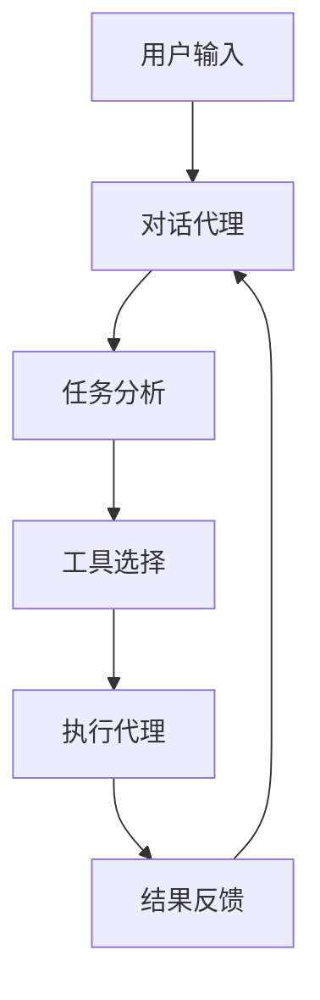

# MCP 核心原理详解

## 架构概述

MCP (Mission Control Protocol) 是一个基于 AI 的代码协作系统，它通过智能代理（Agent）模式实现了代码编辑器与各种开发工具的无缝集成。

### 核心组件

1. **AI 代理系统**
   - 智能对话引擎
   - 上下文管理器
   - 任务规划器
   - 代码分析器

2. **工具集成层**
   - GitHub API 集成
   - 文件系统操作
   - 代码编辑功能
   - 终端命令执行

3. **通信协议**
   - WebSocket 实时通信
   - REST API 接口
   - 事件驱动机制

## 工作原理

### 1. 智能代理模式

MCP 采用智能代理模式，每个代理都具备特定的能力和职责：



### 2. 上下文管理

- 会话状态追踪
- 历史记录维护
- 环境变量管理
- 用户偏好存储

### 3. 工具调用机制

MCP 通过统一的工具调用接口实现功能扩展：

```typescript
interface ToolCall {
  name: string;
  parameters: Record<string, any>;
  execute(): Promise<Result>;
}
```

### 4. 错误处理和恢复

- 异常检测
- 自动重试机制
- 回滚操作
- 状态恢复

## 核心功能实现

### 1. 代码理解

MCP 使用先进的代码分析技术：
- AST 分析
- 语义理解
- 依赖分析
- 上下文推断

### 2. 智能建议

系统通过以下方式提供建议：
- 模式识别
- 最佳实践匹配
- 历史数据分析
- 实时反馈

### 3. 自动化操作

- 代码重构
- 文件管理
- 版本控制
- 构建部署

## 性能优化

### 1. 缓存机制

- 内存缓存
- 文件缓存
- 查询缓存
- 结果缓存

### 2. 并发处理

- 任务队列
- 并发控制
- 资源管理
- 负载均衡

## 安全机制

### 1. 访问控制

- 身份认证
- 权限验证
- 操作审计
- 敏感信息保护

### 2. 数据安全

- 加密传输
- 安全存储
- 数据备份
- 隐私保护

## 扩展机制

### 1. 插件系统

- 插件接口
- 生命周期管理
- 配置管理
- 动态加载

### 2. 自定义集成

- API 扩展
- 工具链集成
- 自定义命令
- 工作流定制

## 最佳实践

### 1. 开发流程

- 代码规范
- 测试策略
- 部署流程
- 监控反馈

### 2. 性能优化

- 响应时间优化
- 资源使用优化
- 并发处理优化
- 缓存策略优化

## 未来展望

### 1. 技术演进

- AI 能力增强
- 工具集成扩展
- 性能优化
- 用户体验提升

### 2. 生态建设

- 社区贡献
- 插件市场
- 最佳实践分享
- 培训资源

## 参考资料

1. [Cursor 官方文档](https://cursor.sh/)
2. [GitHub API 文档](https://docs.github.com/en/rest)
3. [AI Agent 系统设计](https://example.com/ai-agent)
4. [WebSocket 协议规范](https://tools.ietf.org/html/rfc6455)